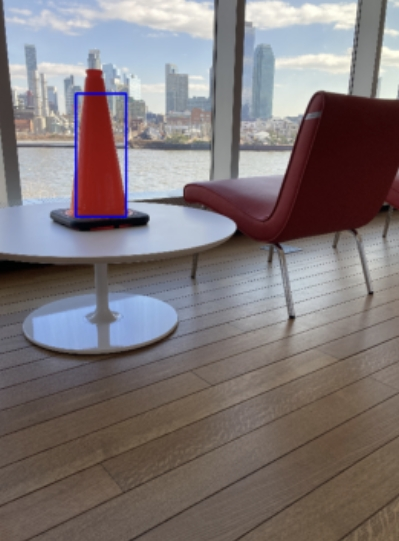

# Cone Detection & Distance Estimation (HSV + GMM)

This project detects orange traffic cones in images using pixel-wise color segmentation with a Gaussian Mixture Model (GMM) trained via EM (implemented from scratch), then estimates cone distance from bounding-box pixel height.



## Method
1. Convert image BGR -> HSV
2. Compute cone likelihood p(x|cone) and background likelihood p(x|bg) using two GMMs
3. Segment pixels by: p(x|cone) > alpha * p(x|bg)
4. Connected components -> candidate cone regions
5. Merge split regions (x-center threshold)
6. Use the tallest bbox as the cone (to suppress reflections)
7. Distance model: d = a / h_pix (a is calibrated from training filenames distXXX)

## Repo Structure
```
├─ main.py
├─ README.md
├─ requirements.txt
├─ gmm_cone_bg_hsv.npz
├─ label_roi.py
├─ ECE5242Proj1-test/
│  └─ 25 training images named in "train_{order}_dist{distance(cm)}.png"
├─ ECE5242Proj1-test/
│  └─ (put your image to test)
├─ assets/
│  └─ demo images
```

## Run
```bash
python main.py data/ECE5242Proj1-test results.txt
```
Output format: ImageName:xxx.png, Down: ..., Right: ..., Distance: ...
